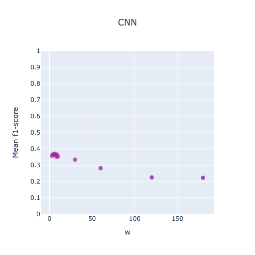

# Superior Scoring Rules for Probabilistic Evaluation of Single-Label Multi-Class Classification Tasks

[Rouhollah Ahmadian](https://www.linkedin.com/in/ruhollah-ahmadian)<sup>1</sup> ,
[Mehdi Ghatee](https://aut.ac.ir/cv/2174/MEHDI-GHATEE?slc_lang=en&&cv=2174&mod=scv)<sup>1</sup>,
[Johan Wahlström](https://emps.exeter.ac.uk/computer-science/staff/cw840)<sup>2</sup><br>
<sup>1</sup>Amirkabir University of Technology, <sup>2</sup>University of Exeter, <sup>3</sup>University of Tehran

*If you use our method, please cite it by*:
```
@article{ahmadian2025superior,
  title={Superior scoring rules for probabilistic evaluation of single-label multi-class classification tasks},
  author={Ahmadian, Rouhollah and Ghatee, Mehdi and Wahlstr{\"o}m, Johan},
  journal={International Journal of Approximate Reasoning},
  pages={109421},
  year={2025},
  publisher={Elsevier}
}
```

## About The Project
This study introduces novel superior scoring rules called Penalized Brier Score (PBS) and Penalized Logarithmic Loss (PLL) to improve model evaluation for probabilistic classification.
Traditional scoring rules like Brier Score and Logarithmic Loss sometimes assign better score to misclassifications in comparison with correct classifications.
This discrepancy from the actual preference for rewarding correct classifications can lead to suboptimal model selection.
By integrating penalties for misclassifications, PBS and PLL modify traditional proper scoring rules to consistently assign higher scores to correct predictions.

## Code

```python
import tensorflow as tf
import math

# Penalized Brier Score (PBS)
def pbs(y, q):
    y = tf.cast(y, tf.float32)
    c = y.get_shape()[1]

    ST = tf.math.subtract(q, tf.reduce_sum(tf.where(y == 1, q, y), axis=1)[:, None])
    ST = tf.where(ST < 0, tf.constant(0, dtype=tf.float32), ST)
    payoff = tf.reduce_sum(tf.math.ceil(ST), axis=1)
    M = (c - 1) / (c)
    payoff = tf.where(payoff > 0, tf.constant(M, dtype=tf.float32), payoff)
    return tf.math.reduce_mean(tf.math.reduce_mean(tf.math.square(tf.math.subtract(y, q)), axis=1) + payoff)

# Penalized Logarithmic Loss (PLL) 
def pll(y, q):
    y = tf.cast(y, tf.float32)
    c = y.get_shape()[1]

    ST = tf.math.subtract(q, tf.reduce_sum(tf.where(y == 1, q, y), axis=1)[:, None])
    ST = tf.where(ST < 0, tf.constant(0, dtype=tf.float32), ST)
    payoff = tf.reduce_sum(tf.math.ceil(ST), axis=1)
    M = math.log(1 / c)
    payoff = tf.where(payoff > 0, tf.constant(M, dtype=tf.float32), payoff)
    log_loss = tf.keras.losses.categorical_crossentropy(y, q)
    p_log_loss = tf.cast(log_loss, tf.float32) - payoff
    return tf.math.reduce_mean(p_log_loss)
```

## Files & Directories

1. Superior_Scoring_Rules.ipynb: It includes the implementation and analysis of the two proposed superior scoring rules.
2. superior_scoring_rules.py: It includes the implementation of Penalized Brier Score (PBS) and Penalized Logarithmic Loss (PLL).
2. /history: This folder contains images of statistical analysis. 
3. /hyperparameters-tuning: This folder includes the results of hyperparameter tuning.


## Evaluation Methodology

Given the nature of our data being signal-oriented, the technique of $h$-block cross-validation is employed for model
selection and hyperparameter tuning. The below figure shows the evaluation methodogy. Also, each class data is divided
separately and then concatenated. So all three parts have all classes. Therefore, the reported results are the average
of several expeiments.


## Datasets

#### UIFW [[1]](#1)

Theis dataset is a collection of accelerometer data obtained from an Android smartphone positioned in the chest pocket
of 22 participants who were walking in natural environments \cite{casale2012personalization}. This dataset has been
specifically curated for activity recognition research, presenting opportunities to tackle the identification and
authentication of individuals based on their motion patterns.

#### CLD [[2]](#2)

This dataset encompasses localization data recorded from a group of 5 individuals wearing tags on their left ankle,
right ankle, belt, and chest \cite{kaluvza2010agent}. It provides valuable information such as three-dimensional tag
coordinates (x, y, z), and various activities performed, including walking, falling, lying down, sitting, and standing
up.

#### HOP [[3]](#3)

With a focus on 12 healthy older adults aged between 66 and 86, this dataset captures motion data using a wearable
sensor placed at the sternum level \cite{torres2013sensor}.
The dataset is sparse and noisy due to the use of a passive sensor. The collected data includes acceleration readings in
three axes and covers activities such as sitting on a bed, sitting on a chair, lying on a bed, and ambulating (standing
and walking). The data was acquired in clinical room settings with the aid of RFID reader antennas.

#### Drivers [[4]](#4)

The dataset included three-axis accelerometer and three-axis gyroscope data from ten drivers, and the goal was to identify drivers based on their driving behaviors.

#### MFT [[5]](#5)

This dataset was generated for use on 'Prediction of Motor Failure Time Using An Artificial Neural Network' project (DOI: 10.3390/s19194342). A cooler fan with weights on its blades was used to generate vibrations. To this fan cooler was attached an accelerometer to collect the vibration data. With this data, motor failure time predictions were made, using an artificial neural networks. To generate three distinct vibration scenarios, the weights were distributed in three different ways: 1) 'red' - normal configuration: two weight pieces positioned on neighboring blades; 2) 'blue' - perpendicular configuration: two weight pieces positioned on blades forming a 90° angle; 3) 'green' - opposite configuration: two weight pieces positioned on opposite blades. A schematic diagram can be seen in figure 3 of the paper.

#### PC [[6]](#6)

The dataset provided information about power consumption such as temperature, humidity, wind speed, consumption, general diuse flows, diuse flows in three zones of Tetouan City, which is suitable for predicting a zone based on consumption information.

#### PRSA [[7]](#7)

The dataset includes hourly air pollutant data such as PM2.5, PM10, SO2, NO2, CO, O3, temperature, pressure, dew point temperature, precipitation, wind direction, wind speed from 12 air-quality monitoring sites, and the proposed model predicted the sites based on their air-quality information.

#### RSSI [[8]](#8)

The dataset was collected with help of students. Twelve students were divided to three groups and each student had iTAG device. They walked inside their limited area with activated iTAG. In long corridor, 18.35m x 3m, we denoted 3 areas which illustrate building's entry: inside, in vestibule and outside. Two smartphones, Sony Xperia XA1, received signals. They located at the start and end of 'in vestibule' area, which has length of 2.35m. Collection of RSSIs lasted for 20 minutes.
There are two datasets: filtered_rssi and raw_rssi. We used feedback filter to smooth RSSI. Raw RSSIs are actual RSSIs that smartphone got.
While the primary task was indoor localization, the proposed model aimed to identify participants based on their location.

#### WISDM [[9]](#9)

For a detailed description of the dataset, please see the following pdf file that is stored with the data: WISDM-dataset-description.pdf. The raw accelerometer and gyroscope sensor data is collected from the smartphone and smartwatch at a rate of 20Hz. It is collected from 51 test subjects as they perform 18 activities for 3 minutes apiece. The sensor data for each device (phone, watch) and type of sensor (accelerometer, gyroscope) is stored in a different directory (so there are 4 data directories). In each directory there are 51 files corresponding to the 51 test subjects. The format of every entry is the same: . The descriptions of these attributes are provided with the attribute information. In addition to the raw time-series sensor data we also generate examples that describe the sensor data using a 10-second window. See the dataset description document for details. Although this data can most naturally be used for activity recognition, it can also be used to build behavioral biometric models since each sensor reading is associated with a specific subject.

## Hyperparameters

It is important to optimize parameters to have a fair comparison between the proposed model and baseline models.
We use grid search to find the best model configurations.
The hyperparameters of this project:

* `w`: it refers to the window length used in segmentation.
* `r`: it is the window overlap. As it take a lot of computing though, `r` is fixed at 75\% for all experiments.

#### Hyperparameters Tuning

| Dataset | Grid Search Result                                                                                   | Dataset | Grid Search Result                                                                     | Dataset | Grid Search Result                                                                                   |
|---------|------------------------------------------------------------------------------------------------------|---------|----------------------------------------------------------------------------------------|---------|------------------------------------------------------------------------------------------------------|
| CLD     |                  | MFT     |  | RSSI    |                              |
| Drivers |              | PC      |   | UIFW    |  |
| HOP     |              | PRSA    |            | WISDM   |                             |

## CNN Classifier


## References

<a id="1">[1]</a>
https://archive.ics.uci.edu/ml/datasets/User+Identification+From+Walking+Activity

<a id="1">[2]</a>
https://archive.ics.uci.edu/ml/datasets/Localization+Data+for+Person+Activity

<a id="1">[3]</a>
https://archive.ics.uci.edu/ml/datasets/Activity+recognition+with+healthy+older+people+using+a+batteryless+wearable+sensor

<a id="1">[4]</a>
https://github.com/mghatee/Overall-Driving-Behavior-Recognition-By-Smartphone

<a id="1">[5]</a>
https://archive.ics.uci.edu/ml/datasets/Accelerometer

<a id="1">[6]</a>
https://archive.ics.uci.edu/ml/datasets/Power+consumption+of+Tetouan+city

<a id="1">[7]</a>
https://archive.ics.uci.edu/ml/datasets/Beijing+Multi-Site+Air-Quality+Data

<a id="1">[8]</a>
https://archive.ics.uci.edu/ml/datasets/BLE+RSSI+dataset+for+Indoor+localization

<a id="1">[9]</a>
https://archive.ics.uci.edu/ml/datasets/WISDM+Smartphone+and+Smartwatch+Activity+and+Biometrics+Dataset+
